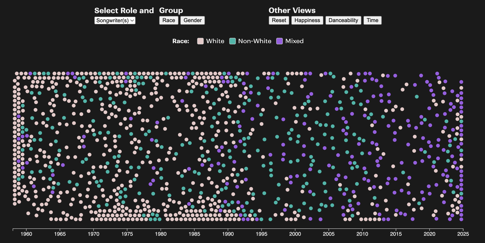

# A Different Look at Billboard's Hot 100 Top Songs

**Author:** Begum Akkas

An interactive D3.js visualization of every song that hit #1 on the Billboard Hot 100 between **August 4, 1958** and **January 11, 2025**. The project focuses on **who** is behind these hits (artists vs. songwriters) and how representation, song mood (happiness, danceability), and time trends show up in the data.

**Live site:** https://charting-bars.pages.dev/ 

## Overview

The visualization lets you explore all Billboard Hot 100 number-one songs through several lenses:

- **Gender:** What share of songs involve at least one **female** songwriter or artist?
- **Race:** How do songs break down by **race** of the artists and songwriters?
- **Mood & Movement:** How do **happiness** (valence) and **danceability** vary across songs and by race or gender?
- **Time:** How have race and gender patterns changed over time?  



## Project Structure

```
├── README.md
├── cleaning
│   └── data_cleaner.py                 # script for processing data
├── preview.png
├── pyproject.toml
└── www             
    ├── data
    │   ├── Billboard100_cleaned.csv    # processed data
    │   ├── Billboard100_summary.csv    # processed data
    │   ├── Billboard100_data.csv       # raw data
    ├── index.html
    ├── js
    │   ├── d3.v7.js
    │   └── main.js                     # D3 visualization
    └── style.css                       # custom CSS
```


## Sources
Public data by Chris Dalla Riva [here](https://docs.google.com/spreadsheets/d/1j1AUgtMnjpFTz54UdXgCKZ1i4bNxFjf01ImJ-BqBEt0/edit?gid=1974823090#gid=1974823090).


## Acknowledgements

This visualization was completed for coursework in Data Visualization (University of Chicago, Fall 2025). Special thanks to James Turk and peers for feedback on visual design and communication.