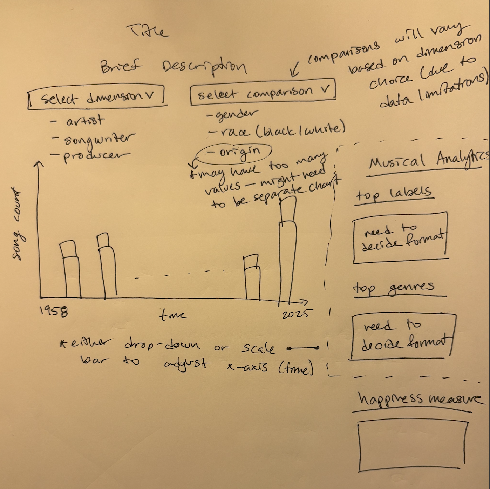

# Begum Akkas

## Description

I want to visualize demographic trends in Billboard's top 100 songs between 1958 to 2025. The main categories I plan on including as trends are as follows: gender, artist origin, artist race. I also want to incorporate a singer vs. songwriter layer in order to explore these demographics in relation to varying trends that may exist for whether you're a singer or a songwriter. 

## Technical Plan re: Option A/B/C/D

**Option A: Large Interactive**   
I am considering one main chart/visualization because all of my variables will show time trends. Therefore, having a consistent graph that users can toggle should convey the information clearly. I will also think about what additional visualizations I may want to include on the side, perhaps some fun statistics about the other fields in my data (song characteristics). 

**Libraries:** d3.js, pandas 

**Inspiration pieces:**
- https://pudding.cool/2023/07/songwriters/ 
    - There is a lot here but mainly I'm envisoning a similar bar chart or line chart towards the end of the article
- https://pjsuoc.github.io/conflict-migration/ 
    - I like the drop down menus in this viz

## Mockup

## Data Sources

### Data Source 1: Billboard Hot 100 Number Ones Database

Data: [Link](https://docs.google.com/spreadsheets/d/1j1AUgtMnjpFTz54UdXgCKZ1i4bNxFjf01ImJ-BqBEt0/edit?gid=1974823090#gid=1974823090)

Size: 1,178 rows, 105 columns

This workbook contains substantial data about every song to ever top the Billboard Hot 100 between August 4, 1958 and January 11, 2025. It was compiled by Chris Dalla Riva.

The fields I will primarily use are as follows: song, artist, date, artist place of origin, artist male, artist white, artist black, songwriter male, songwriter white, artist is a songwriter, artist is only songwriter.  

## Questions

1. I'm not familiar with React or Svelte but it seems like they simplify d3 in a sense? Should we use one of these libraries? I'm unclear if learning that library would help or hinder the project since I haven't used either before. 
2. How do you suggest we approach this project? More specifically, is there a rough order we should tackle tasks in, such as creating SVGs first, then the html structure, etc. This might be a more involved question and if so, I can stop by office hours to discuss. 